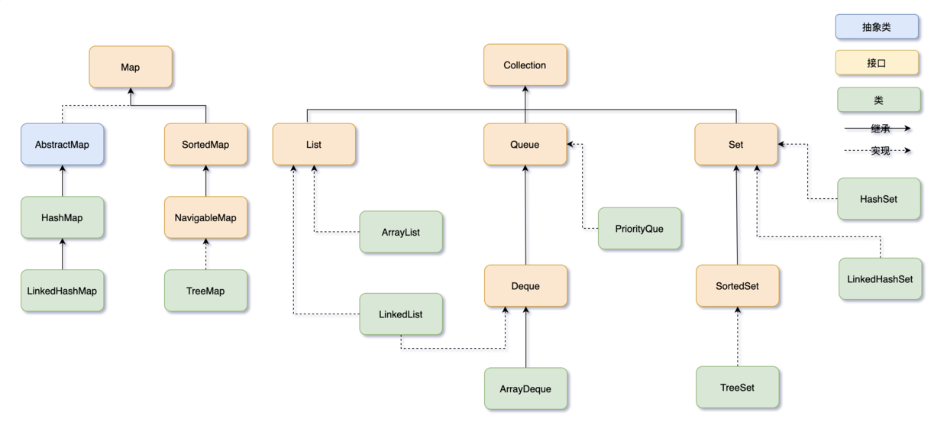

# 集合框架



# Map

## HashMap

### hashmap的实现原理

1. 基于map接口，元素以键值对方式存储，允许有null值，HashMap是线程不安全的。
2. 初始化大小，默认16，2倍扩容；负载因子0.75；
3. - JDK 1.7中数组+链表的存储方式
   - 1.8中数组+链表+红黑树

### Jdk1.7 和 1.8 hashmap 有什么区别
- 1.7数组+链表，1.8数组+链表+红黑树
- 发生 hash 碰撞时,JDK1.7 是头插法,而JDK1.8是尾插法
- 在 JDK1.8 中,当链表长度大于等于8,数组长度大于等于64时会转化为红黑树,小于 64 的时候只会扩容

### HashMap 的扩容机制

- HashMap的扩容实质上就是数组的扩容，会重新开辟一份2倍原数组容量的数组将老数组的元素转移过来
  * 在JDK 7下会将老数组中的元素重新进行hash值计算得到新数组的下标，然后放到对应数组的槽位的链表上，扩容的目的主要是为了解决链表过长的问题
  * 在 JDK 1.8 中，无论是链表还是红黑树，都是使用原始哈希值与旧数组长度进行位与运算来确定元素在新数组中的位置。
    * 对于链表，直接将节点转移到新的位置；
    * 对于红黑树，会将其拆分为两个子链表，并根据链表的长度和新数组的长度来决定是否将其转化为红黑树或者将红黑树退化为链表。

#### 补充

##### JDK1.7中新位置的计算
```
-JDK1.7中 新数组的位置  = key的hash值 &（新数组长度减一）
                      = key的hash值  %  新数组长度
```

##### JDK1.8中新位置的计算
JDK1.8+在扩容时，不需要重新计算元素的hash进行元素迁移。

而是用原先位置key的hash值与旧数组的长度（oldCap）进行"与"操作。

1. 如果结果是0，那么当前元素的桶位置不变。
2. 如果结果为1，那么桶的位置就是原位置+原数组 长度

##### 1.8中何时转化为红黑树
当链表长度大于等于8,数组长度大于等于64时

##### 1.8中取消树化
- 当红黑树的节点个数小于等于6时，会将红黑树退化为链表。这是因为红黑树的节点数量比较少时，使用链表的存储方式更为高效。因此，在一定条件下，HashMap会将红黑树恢复为链表，以节省空间和提高性能。


### HashMap的get流程

- 基于key的hash值计算得到数组的下标，然后遍历每个槽位(链表/红黑树)通过equals方法进行查找Key相同的元素


